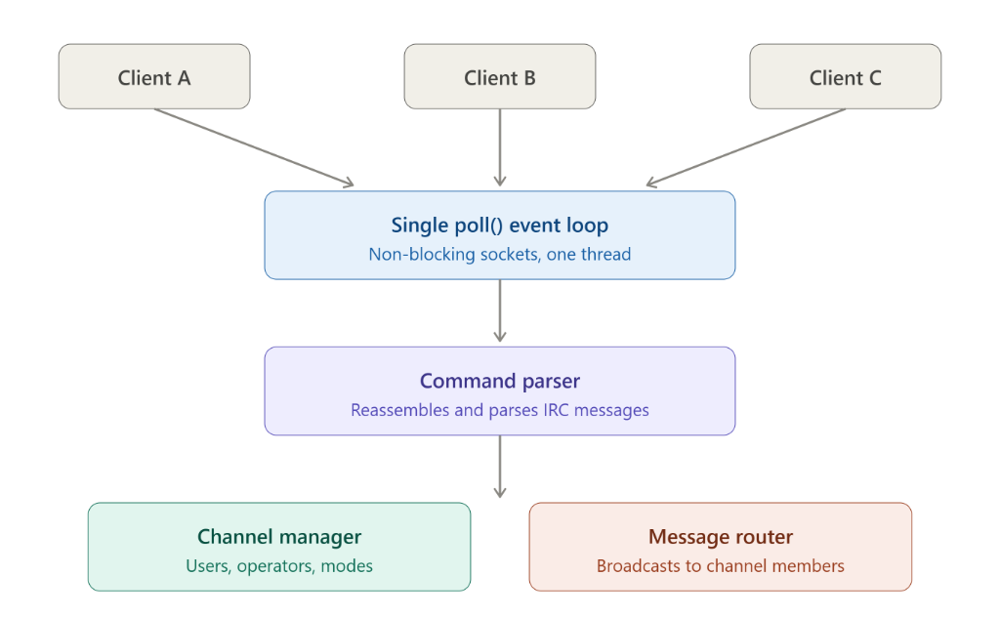

# ft_irc

An IRC server written in C++98.

The idea is simple. IRC (Internet Relay Chat) is one of the oldest real-time communication protocols on the internet. It was created in 1988 and at its core it is just text messages being routed between clients through a central server. No fancy UI, no encryption in the original spec, just raw TCP sockets and a well-defined text protocol.

This project implements a server that speaks the IRC protocol. You run it, clients connect to it, and they can talk to each other through channels or directly. The server never initiates communication. It just listens, parses what clients send, and routes messages where they need to go.

## How it works

The server opens a TCP socket and listens on the port you give it. When a client connects, the server adds it to a poll() watchlist. From there everything is event-driven. A single thread, a single process. The main loop calls poll(), which blocks until something happens on any of the watched file descriptors. When data arrives from a client, the server reads it into a buffer, extracts complete lines (terminated by \r\n as the IRC spec requires), parses them, and dispatches the appropriate command handler.

Non-blocking I/O is important here. Every socket is set to O_NONBLOCK so a slow client can never stall the entire server. Outgoing data goes into a per-client write buffer and gets flushed when poll() reports the socket is writable (POLLOUT). This way you never block on send() either.

The protocol itself is text-based. A typical IRC message looks like this:

    PRIVMSG #general :hello everyone

or with a source prefix:

    :nick!user@host PRIVMSG #general :hello everyone

The server parses these into a command name and a list of arguments, then routes to the right handler. Registration happens through three commands in sequence: PASS (authenticate with the server password), NICK (pick a nickname), and USER (provide username and real name). Only after all three succeed does the server send the welcome numerics and consider the client registered.

## Channels

Channels are the rooms where group conversations happen. Any registered client can create one by joining a name that starts with #. The first person to join an empty channel becomes its operator. Operators can set channel modes:

    +i  invite-only (clients must be invited before they can join)
    +t  topic-restricted (only operators can change the topic)
    +k  key-protected (clients need the right password to join)
    +l  user limit (cap on how many people can be in the channel)
    +o  give or take operator status from another member

Operators can also kick users from the channel and invite people into invite-only channels.

## Building

    make

That gives you the ircserv binary. You need a Unix system with a C++98 compiler. The Makefile uses -Wall -Wextra -Werror so nothing compiles if there are warnings.

    make clean     removes object files
    make fclean    removes object files and the binary
    make re        full rebuild

## Running

    ./ircserv <port> <password>

Port is what the server listens on. Password is what clients must provide via the PASS command before they can register. You can connect with any IRC client (irssi, HexChat, WeeChat) or just netcat for testing:

    nc localhost 6667
    PASS mypassword
    NICK testuser
    USER testuser 0 * :Test User
    JOIN #test
    PRIVMSG #test :hello

## The code

The server is split into a few logical areas.

Server core handles the socket lifecycle: creating the listening socket, accepting connections, the poll() event loop, reading and writing data, and cleaning up disconnected clients. The entry point sets up signal handlers for SIGINT (so ctrl-c shuts down gracefully) and SIGPIPE (ignored, because writing to a closed socket should not crash the server).

The command parser takes a raw IRC line, strips the optional prefix, splits out the command name, separates the trailing parameter (everything after " :"), and passes it all to the right handler function.

Client management tracks each connection's state: file descriptor, nickname, username, registration progress, input buffer, and output buffer. A client is considered registered once it has successfully completed PASS, NICK, and USER.

Channel management handles the room logic: member lists, operator sets, invite lists, mode flags, topic, key, and user limit. The broadcast function sends a message to every member of a channel except an optional excluded client (usually the sender).

The command handlers themselves are broken into auth commands (PASS, NICK, USER, QUIT, PING), channel commands (JOIN, NAMES), operator commands (KICK, INVITE, TOPIC), mode handling, and messaging (PRIVMSG).

## What this is not

This is not a full IRC network implementation. There is no server-to-server linking, no services framework, no TLS, no WHOIS, no LIST, no PART (clients leave channels by disconnecting or getting kicked). It implements the subset that the 42 ft_irc subject requires: a working multi-client server that handles authentication, channels with modes, and private messaging, all through non-blocking I/O with poll().

## Resources

These are the documents and references that were useful while building this. The RFCs define the protocol, the guides explain the networking concepts, and the open-source servers are good for seeing how production implementations handle edge cases.

Protocol specifications:
https://www.rfc-editor.org/rfc/rfc1459
https://www.rfc-editor.org/rfc/rfc2812
https://www.rfc-editor.org/rfc/rfc2813

Modern IRC documentation:
https://modern.ircdocs.horse/
https://ircv3.net/irc/
https://www.irchelp.org/protocol/rfc/

Networking and systems programming:
https://beej.us/guide/bgnet/html/
https://beej.us/guide/bgnet/html/split-wide/slightly-advanced-techniques.html
https://man7.org/linux/man-pages/man7/epoll.7.html
https://man7.org/linux/man-pages/man2/poll.2.html
https://man7.org/linux/man-pages/man2/fcntl.2.html
https://github.com/angrave/SystemProgramming/wiki/Networking,-Part-7:-Nonblocking-I-O,-select(),-and-epoll
http://www.kegel.com/c10k.html

Open-source IRC servers worth reading:
https://github.com/unrealircd/unrealircd
https://github.com/inspircd/inspircd
https://github.com/UndernetIRC/ircu2
